# DM PSet 3
Integrantes: Anthony Fajardo, Nicolas Soria, Ryan De La Torre, Juan Pablo Bautista

Proyecto de Data Mining PSet 3: Spark (Jupyter) + Snowflake con modelo RAW y One Big Table (`ANALYTICS.OBT_TRIPS`).

## Arquitectura

Flujo implementado:

`NYC TLC Parquet (2015-2025, yellow/green) -> Spark notebooks -> Snowflake RAW -> enriquecimiento/unificacion -> ANALYTICS.OBT_TRIPS -> analisis (20 preguntas)`

Componentes:

- `pyspark-notebook` (Docker Compose): Jupyter + Spark
- Snowflake: esquemas `RAW` y `ANALYTICS`

## Estructura del repo

- `docker-compose.yml`
- `.env.example` (sin secretos)
- `notebooks/01_ingesta_parquet_raw.ipynb`
- `notebooks/02_enriquecimiento_y_unificacion.ipynb`
- `notebooks/03_construccion_obt.ipynb`
- `notebooks/04_validaciones_y_exploracion.ipynb`
- `notebooks/05_data_analysis.ipynb`
- `evidencias/`

## Levantar infraestructura

1. Completa credenciales reales en `.env`
2. Inicia servicios:

```bash
docker compose up -d
```

3. Verifica:

```bash
docker compose ps
```

4. Abre Jupyter: `http://localhost:8888`
5. Spark UI: `http://localhost:4040`

Evidencias de infraestructura:

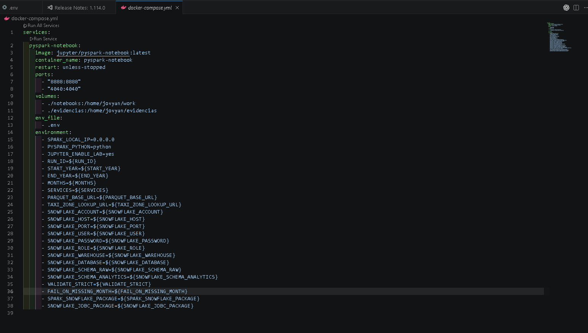
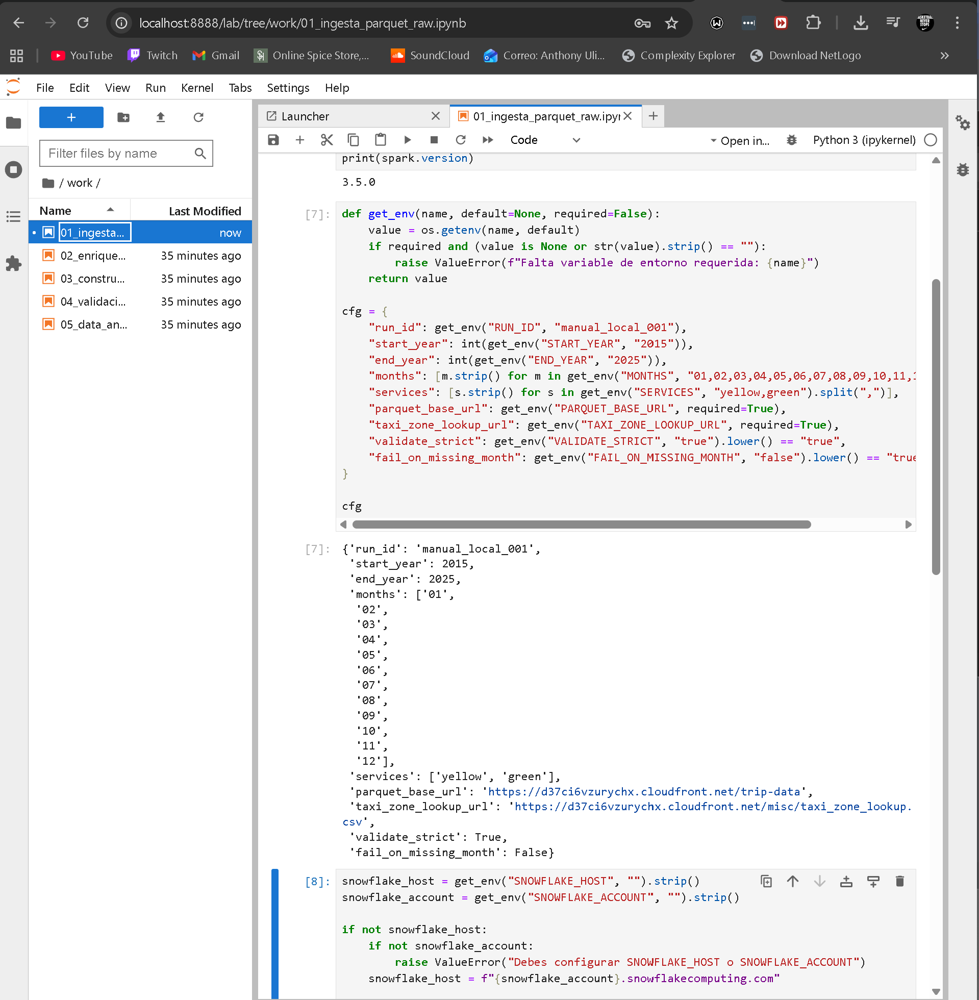
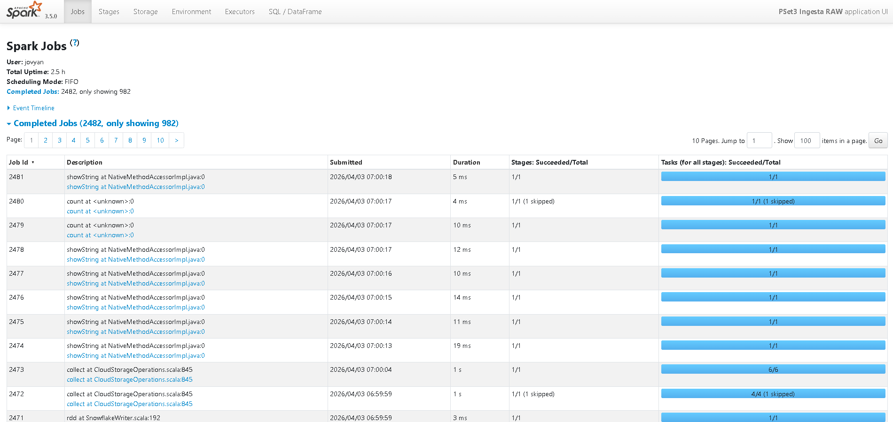

## Variables de ambiente

Maneja todo por `.env` (obligatorio).

Snowflake:

- `SNOWFLAKE_ACCOUNT` o `SNOWFLAKE_HOST`
- `SNOWFLAKE_PORT`
- `SNOWFLAKE_USER`
- `SNOWFLAKE_PASSWORD`
- `SNOWFLAKE_ROLE`
- `SNOWFLAKE_WAREHOUSE`
- `SNOWFLAKE_DATABASE`
- `SNOWFLAKE_SCHEMA_RAW`
- `SNOWFLAKE_SCHEMA_ANALYTICS`

Fuente/parquet:

- `PARQUET_BASE_URL`
- `TAXI_ZONE_LOOKUP_URL`

Parametros pipeline:

- `START_YEAR`, `END_YEAR`, `MONTHS`, `SERVICES`
- `RUN_ID`
- `VALIDATE_STRICT`, `FAIL_ON_MISSING_MONTH`

## Orden de ejecucion

1. `01_ingesta_parquet_raw.ipynb`
2. `02_enriquecimiento_y_unificacion.ipynb`
3. `03_construccion_obt.ipynb`
4. `04_validaciones_y_exploracion.ipynb`
5. `05_data_analysis.ipynb`

## Diseño RAW

- Tabla principal: `RAW.TRIPS`
- Auditoria: `RAW.INGESTION_AUDIT`
- Metadatos de ingesta: `run_id`, `service_type`, `source_year`, `source_month`, `ingested_at_utc`, `source_path`
- Idempotencia en ingesta por `trip_nk` + anti-join por particion mensual

## Diseño OBT

Tabla: `ANALYTICS.OBT_TRIPS`

Grano:

- 1 fila = 1 viaje

Incluye:

- tiempo, ubicacion, servicio/codigos, viaje, tarifas
- derivadas: `trip_duration_min`, `avg_speed_mph`, `tip_pct`
- lineage: `run_id`, `ingested_at_utc`, `source_service`, `source_year`, `source_month`

Calidad aplicada en OBT:

- fechas en rango 2015-2025
- `trip_distance` en `[0, 100]`
- `trip_duration_min` en `[1, 240]`
- montos no negativos
- `avg_speed_mph` en `[1, 120]` (si no nulo)
- `passenger_count` en `[1, 6]` (si no nulo)

## Calidad y auditoria

Validaciones en notebook 04:

- nulos esenciales
- rangos lógicos y outliers de negocio
- coherencia temporal pickup/dropoff
- consistencia `year` vs `source_year`
- cobertura esperada `264` lotes (11 anios x 12 meses x 2 servicios)

Auditoria en `RAW.INGESTION_AUDIT`:

- estado por lote (`OK`, `MISSING_SOURCE`, `FAILED`)
- tiempos de carga y volumentria (`records_in`, `records_out`)

Evidencias de calidad y auditoria:

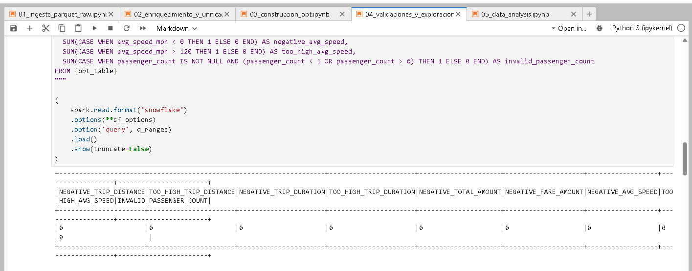
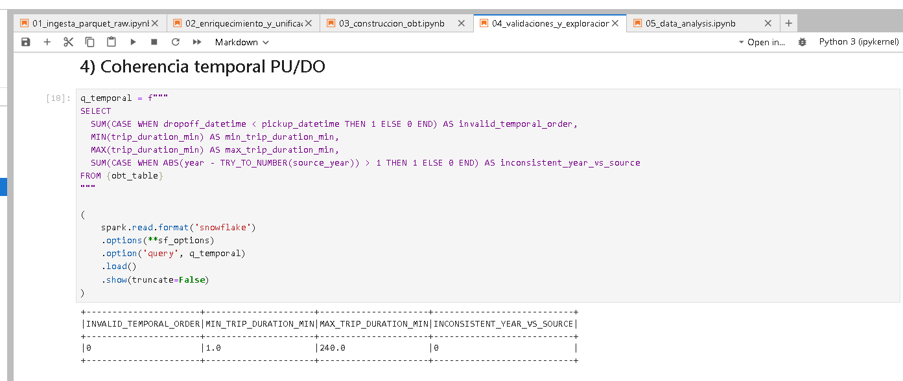
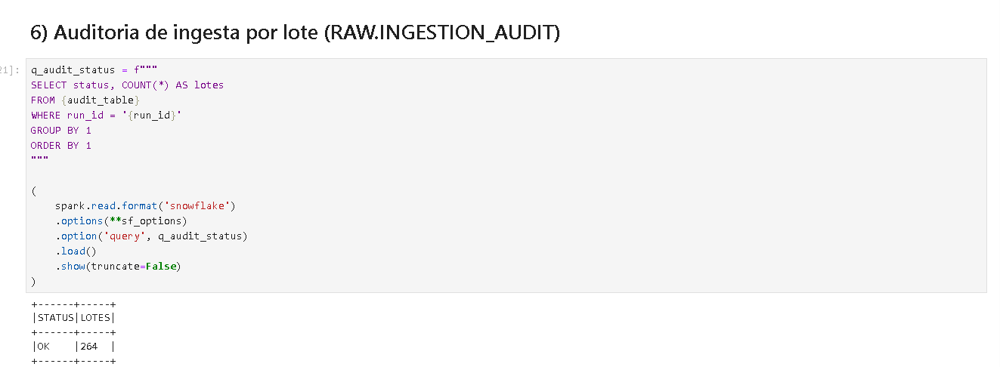
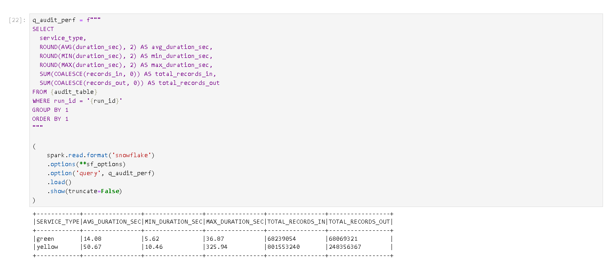

## Cobertura 2015-2025 (matriz)

Consulta usada para matriz de cobertura por servicio/mes:

```sql
SELECT service_type, source_year, source_month, COUNT(*) AS rows_obt
FROM ANALYTICS.OBT_TRIPS
GROUP BY 1,2,3
ORDER BY 1,2,3;
```

Matriz final (estado por servicio/anio/mes):

| service_type | year | m01 | m02 | m03 | m04 | m05 | m06 | m07 | m08 | m09 | m10 | m11 | m12 |
|---|---:|---|---|---|---|---|---|---|---|---|---|---|---|
| yellow | 2015 | OK | OK | OK | OK | OK | OK | OK | OK | OK | OK | OK | OK |
| yellow | 2016 | OK | OK | OK | OK | OK | OK | OK | OK | OK | OK | OK | OK |
| yellow | 2017 | OK | OK | OK | OK | OK | OK | OK | OK | OK | OK | OK | OK |
| yellow | 2018 | OK | OK | OK | OK | OK | OK | OK | OK | OK | OK | OK | OK |
| yellow | 2019 | OK | OK | OK | OK | OK | OK | OK | OK | OK | OK | OK | OK |
| yellow | 2020 | OK | OK | OK | OK | OK | OK | OK | OK | OK | OK | OK | OK |
| yellow | 2021 | OK | OK | OK | OK | OK | OK | OK | OK | OK | OK | OK | OK |
| yellow | 2022 | OK | OK | OK | OK | OK | OK | OK | OK | OK | OK | OK | OK |
| yellow | 2023 | OK | OK | OK | OK | OK | OK | OK | OK | OK | OK | OK | OK |
| yellow | 2024 | OK | OK | OK | OK | OK | OK | OK | OK | OK | OK | OK | OK |
| yellow | 2025 | OK | OK | OK | OK | OK | OK | OK | OK | OK | OK | OK | OK |
| green | 2015 | OK | OK | OK | OK | OK | OK | OK | OK | OK | OK | OK | OK |
| green | 2016 | OK | OK | OK | OK | OK | OK | OK | OK | OK | OK | OK | OK |
| green | 2017 | OK | OK | OK | OK | OK | OK | OK | OK | OK | OK | OK | OK |
| green | 2018 | OK | OK | OK | OK | OK | OK | OK | OK | OK | OK | OK | OK |
| green | 2019 | OK | OK | OK | OK | OK | OK | OK | OK | OK | OK | OK | OK |
| green | 2020 | OK | OK | OK | OK | OK | OK | OK | OK | OK | OK | OK | OK |
| green | 2021 | OK | OK | OK | OK | OK | OK | OK | OK | OK | OK | OK | OK |
| green | 2022 | OK | OK | OK | OK | OK | OK | OK | OK | OK | OK | OK | OK |
| green | 2023 | OK | OK | OK | OK | OK | OK | OK | OK | OK | OK | OK | OK |
| green | 2024 | OK | OK | OK | OK | OK | OK | OK | OK | OK | OK | OK | OK |
| green | 2025 | OK | OK | OK | OK | OK | OK | OK | OK | OK | OK | OK | OK |

Estado final consolidado:

- `coverage_ok = True`
- `expected_lotes = 264`
- `real_lotes = 264`

Evidencias de cobertura:

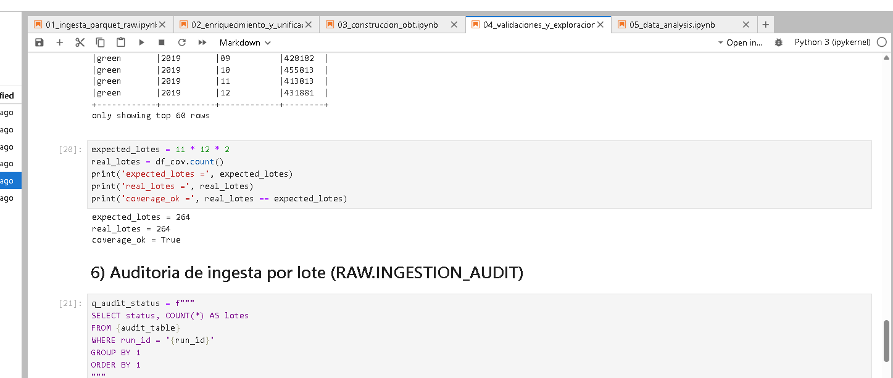
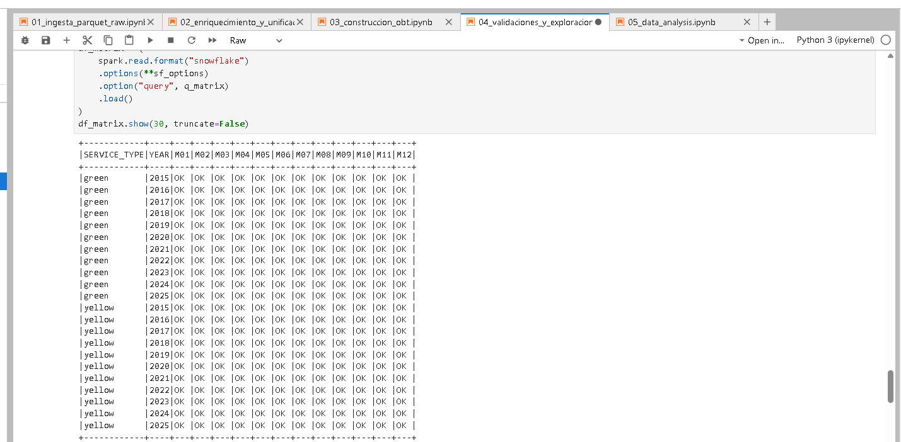
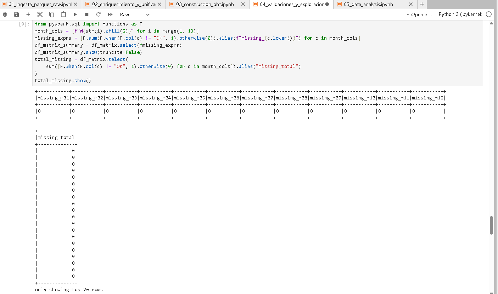

## Resultados obtenidos (corrida final)

- `RAW.INGESTION_AUDIT`: `STATUS=OK`, `LOTES=264`
- Cobertura OBT: `264/264` particiones esperadas
- OBT final: `total_obt = 844201815`
- Calidad OBT: nulos esenciales y reglas de rango/temporal en `0`
- Idempotencia (particion `yellow-2024-12`):
  - `rows_partition = 3597775`
  - `distinct_trip_nk = 3597775`
  - `duplicated_keys = 0`

Evidencia de escritura OBT:

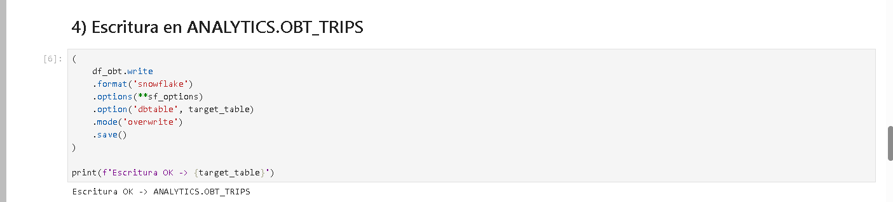

## Idempotencia (evidencia)

En notebook 03 se valida no duplicacion por `trip_nk` en una particion mensual (`IDEMP_SERVICE`, `IDEMP_YEAR`, `IDEMP_MONTH`).

Para evidencia completa del PDF:

1. Reingestar un mes ya procesado en notebook 01.
2. Ejecutar bloque de idempotencia en notebook 03.
3. Confirmar `duplicated_keys = 0` y `rows_partition = distinct_trip_nk`.

Evidencia de idempotencia:

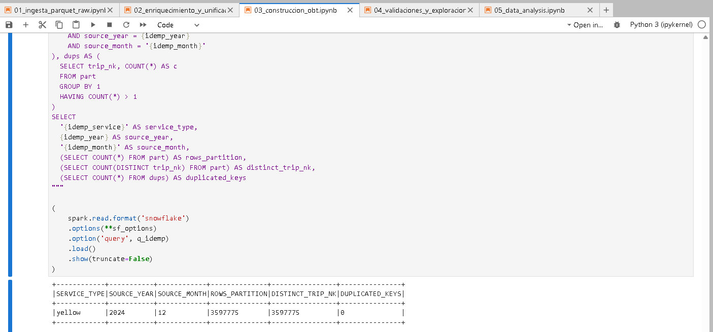

## Evidencias de analisis (notebook 05)

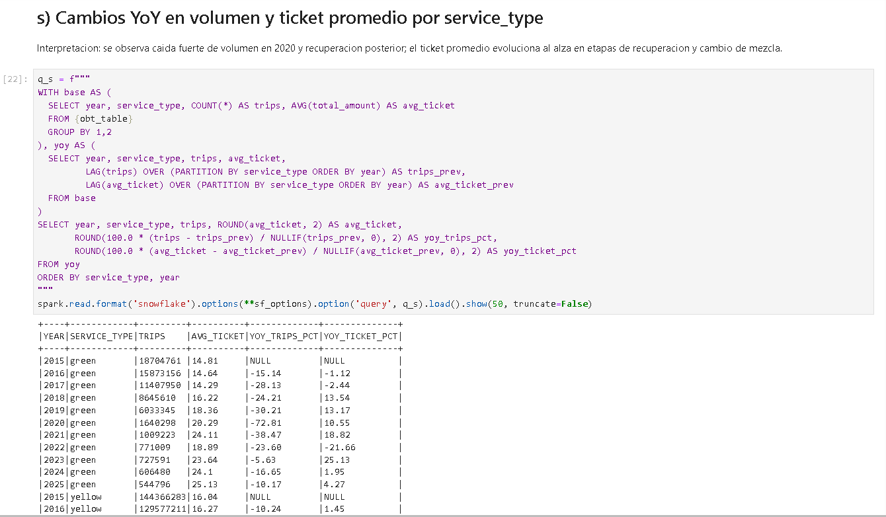
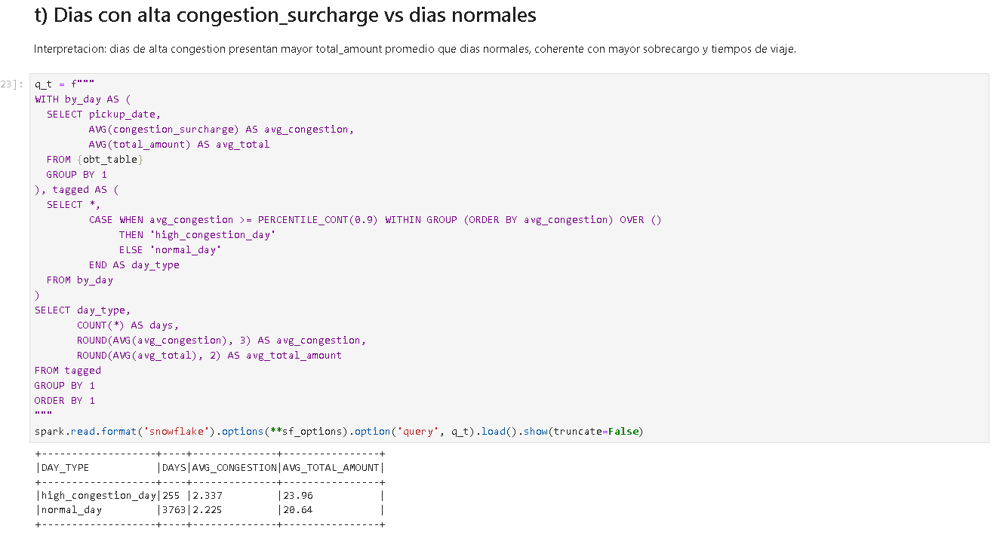

## Evidencias requeridas

Guardado de capturas en `evidencias/`:

- `docker compose ps`
- Jupyter (`8888`) y Spark UI (`4040`)
- resultados de cobertura (`coverage_ok`)
- calidad (`q_ranges`, `q_temporal`)
- auditoria (`q_audit_status`, `q_audit_perf`)
- snapshot de `ANALYTICS.OBT_TRIPS`
